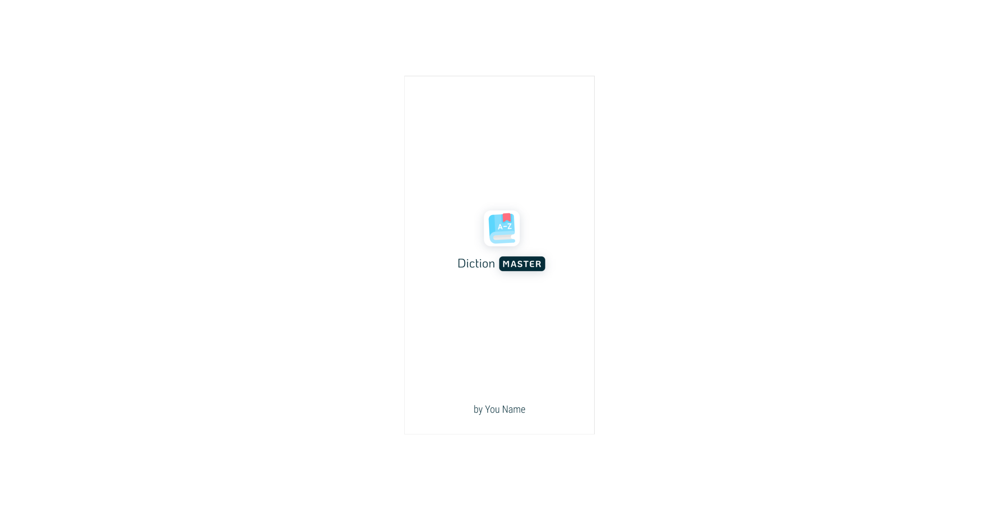
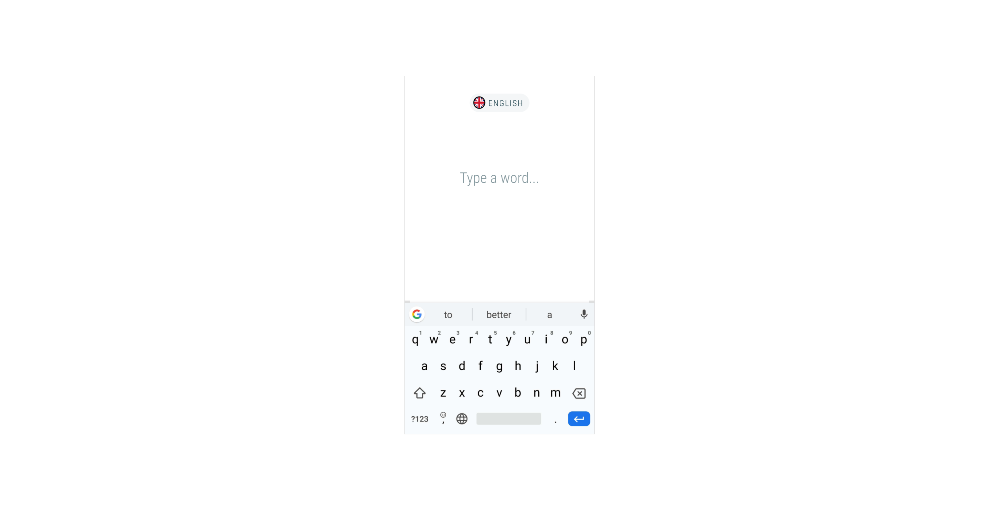
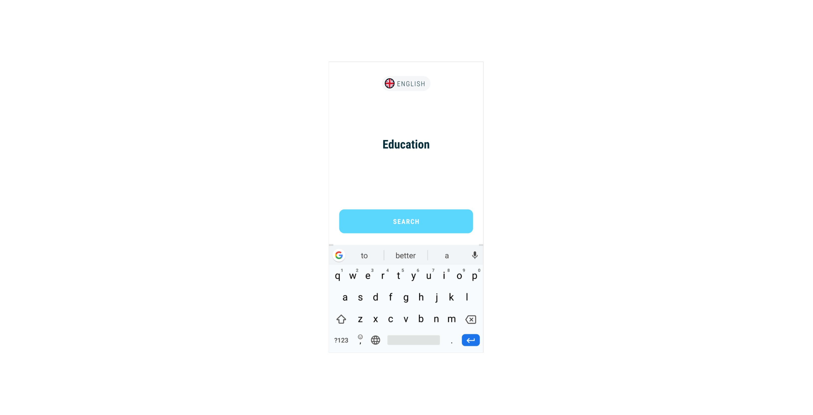
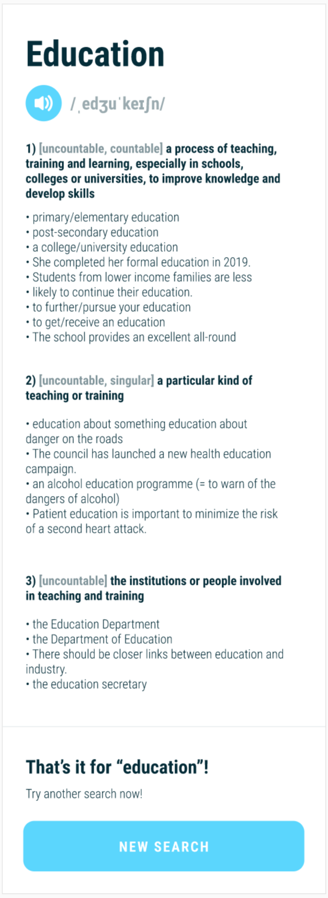
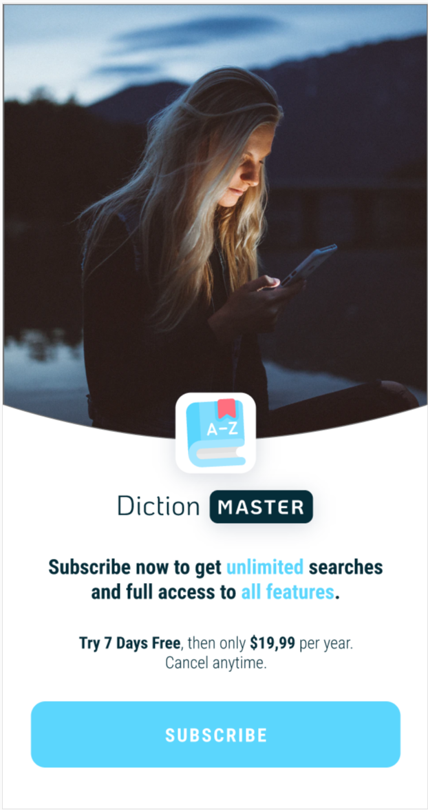

## DictionMaster
> Esse projeto tem como objetivo apresentar um aplicativo de dicionário.

Principais características desse projeto 

- Padrão de arquitetura Clean Archicture e MVVM
- Version Catalog (Gradle) e Kotlin DSL
- Injeção de Dependência
- Telas construídas com Android Jetpack (Compose)
- Uso de módulo

As principais libraries utilizadas no projeto:

- Android Jetpack
- Material 3
- Koin
- Retrofit

# Tela1

